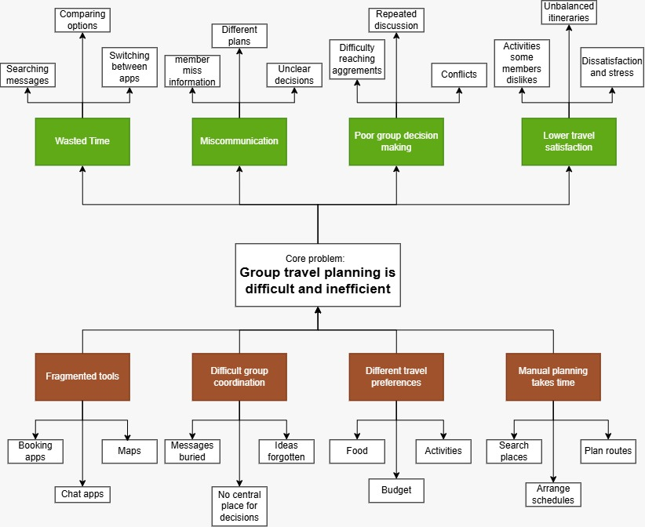

# TripSync by SoHighs

Team: LIM JUN WEI, ERVIN TONG YUAN ZHEN, TAN WEI SIANG, LIM QIN KAI

Problem Statement: Travel Planner

Video Presentation: [Unlisted Youtube Link]

Presentation Slides:
https://www.canva.com/design/DAHU3y7j7vw/WK6gwDNjsfKiSbI-BGutfA/edit?ui=e30

Plan together. Travel smarter. Make every trip count.

## 0. Executive Summary

Group trips fall apart not because people can't find places to go, but because groups can't agree on what to do once they've found them. TripSync is a collaborative travel planner built around Journey Mode — a light-novel-style interactive story that the whole group experiences together, making choices shaped by each member's preferences and the live Group Satisfaction Analysis. The finished story becomes a real day-by-day itinerary, so the group doesn't just read AI suggestions, they live through the decisions that build their trip. It's the first feature in this space that turns group travel planning into something people actually want to do together, not just administrate.

## 1. Understanding the Problem

### The Problem

Planning a trip with friends or family sounds simple — until everyone starts suggesting different things. One person wants tourist attractions, another wants to explore local food, and someone else wants to stay within a strict budget. The planning process quickly turns into a scattered mix of WhatsApp messages, Google Maps links, booking websites, spreadsheets and screenshots.

The core issue isn't finding places to visit — it's reaching agreement when everyone wants something different.

### Causes

- Different preferences — interests, food, budget, activity level and travel style vary across the group
- Fragmented planning — group chats for discussion, maps for locations, booking platforms for accommodation, spreadsheets for itineraries, separate sites for research
- Inefficient decision-making — suggestions get buried in chat, discussions repeat, majority votes can drown out minority preferences, and one person usually ends up as the de facto “trip planner”

### Effects

- Excessive time spent planning
- Decision fatigue from too many messages and back-and-forth discussion
- Unequal representation of preferences within the group
- Difficulty keeping the plan within everyone's budget
- Members feeling the final trip doesn't reflect what they actually wanted
- Overpacked or inefficient itineraries

### Stakeholders

- Group trip organizers (“the person who always ends up planning”)
- Individual group members with differing travel preferences and budgets
- Friend groups, families and student groups traveling together

### Existing Alternatives and Why They Fall Short

- Trip.com / booking platforms — strong for booking flights and hotels, but offer no way for a group to jointly discuss, vote on, or reconcile differing preferences.
- Wanderlog — supports shared itinerary editing and collaborative maps, but has no mechanism to measure whether the plan actually satisfies each member, and no weighting to protect against majority preferences silently overriding minority ones. Suggestions still have to be manually reconciled by whoever is driving the plan.
- TripIt — excellent at consolidating bookings into one itinerary automatically, but is fundamentally a single-user tool with light sharing bolted on; it has no group chat, no voting and no concept of “whose preferences does this trip serve.”
- Group chats (WhatsApp/Telegram) + spreadsheets — the current default “solution” for most groups, but this is exactly the fragmentation problem described above: no map, no itinerary, no consensus mechanism, and nothing to track whose preferences have or haven't been addressed.

## 2. Target Users

TripSync is built for friend, family and student groups of roughly 3–8 people planning a trip together — not a generic “everyone who travels” audience. Each persona below is tied to a specific headline feature rather than described in the abstract, since the rubric rewards a solution that “clearly speaks to their real need,” not just a named audience:

- The Undecided Traveler — wants to travel but has no idea where, or what to actually do once there. Faced with endless travel blogs, TikTok lists and review sites, they freeze rather than choose — decision paralysis, not lack of interest. Served by: Journey Mode turns “where should we even go” from an overwhelming open search into a guided story that narrows options through choices instead of a blank search bar.
- The Interactive-Fiction / Game Lover — already spends time in visual novels, choice-driven mobile games and choose-your-own-adventure apps, and finds conventional trip-planning tools (forms, checklists, spreadsheets) tedious by comparison. Served by: Journey Mode is built in a format this person already understands and enjoys, so planning a real trip feels like playing through a story rather than filling in admin — a genuinely new entry point into travel planning for an audience travel apps don't currently speak to.
- The Reluctant Organizer — the person who ends up building the itinerary alone because someone has to, then absorbs the blame if it doesn't suit everyone. Served by: the shared trip room and AI assistant carry the coordination load instead of their group chat threads.
- The Minority Voice — the member whose interests differ from the majority (e.g. the one food-tour fan in a museum-heavy group) and who normally gets outvoted every round. Served by: preference-weighted voting and the Group Preference Summary exist specifically for this person.

Primary target group: university and young-professional friend groups (roughly ages 18–35) who fall into at least one of two overlapping categories — those who are indecisive about where or what to plan, and those who already engage with interactive fiction, visual novels or choice-driven mobile games and are primed to enjoy Journey Mode's format rather than just tolerate it. This is a sharper audience than “anyone who travels in a group”: corporate travel and solo travelers are explicitly out of scope, both already served by other tools.

## 3. Our Solution & Feature Set

TripSync is an AI-powered collaborative travel planner that helps groups with different preferences reach an itinerary everyone can agree on. A host creates a private trip room and invites friends or family, each with their own account. Members discuss the trip together, suggest attractions and activities, and vote on ideas — all while an AI travel assistant helps generate and adjust the itinerary based on the whole group's input, not just one person's.

### Feature Set

- Journey Mode (headline feature) — a light-novel-style interactive travel experience where the group makes choices together through a branching story, instead of reading a flat list of AI suggestions. Each choice is shaped by individual members' stated preferences and the live Group Satisfaction Analysis, so the story actively steers toward activities the group is currently under-served on. Completed choices translate directly into a real day-by-day itinerary, connecting the interactive experience to the app's core travel-planning function.
- Combined map + itinerary view — an interactive map and the day-by-day itinerary shown together in one interface, rather than as separate tools
- Group chat with integrated AI assistant — members discuss the trip and receive AI-generated itinerary suggestions directly inside the same chat
- Manual itinerary editing — a dedicated itinerary section where the group can adjust timing and activities by hand
- Preference-weighted voting — members vote on proposed activities and places, but votes are weighted by how unaddressed a member's preferences have been so far, so a consistent minority (e.g. the one person who wants food tours while four want museums) can't be silently overridden every time
- AI swap suggestions — rather than only surfacing that a member is underserved, the AI proactively proposes a specific itinerary swap targeted at whoever currently has the lowest individual satisfaction score
- Booking shortcuts — convenient booking buttons for transportation that requires reservation
- Trip calendar — reminders for upcoming trip dates and milestones
- Preference questionnaire at sign-up — captures each member's food, activity, budget and travel-style preferences
- Explainable Group Satisfaction Analysis — an AI-evaluated score for the current itinerary, calculated as a weighted match between each member's questionnaire answers and the current itinerary items, with the lowest-scoring members flagged and a plain-language explanation of what's driving the score
- Group Preference Summary — displayed beneath the satisfaction score, showing each member's avatar alongside their likes and dislikes, so the group can see whose preferences are (or aren't) being represented
- Per-member budget planner — each member sets their own budget cap, and the AI is constrained to respect all members' caps simultaneously when generating suggestions, rather than optimizing to a single group-wide average
- Custom avatars — members choose an avatar at registration to personalize their profile and identify their preferences at a glance

## 4. Ideation & Process

### 4.1 Visual Diagrams and Mindmaps

#### 4.1.1 Problem tree

#### 4.1.2 Brainstorming / Mind Map

Diagram 4.2

Diagram 8.1 starts with the user entering our website that branches out to diagram 8.2 and 8.3

Diagram 4.3

User flow for group admin

Diagram 4.4

User flow for group member

Diagram 4.5

User flow for Journey mode

Diagram 4.6

### 4.2 Iteration and Idea Evolution

The concept went through three distinct stages rather than staying fixed from the first idea:

- V1 — Booking-first group planner. Modeled loosely on Trip.com: flights/hotels booking with a group chat added for suggesting attractions. Dropped because the booking-first framing centered the product on transactions, not on the actual bottleneck we'd identified — groups don't struggle to find bookings, they struggle to agree. The chat felt like an add-on rather than the core mechanic.
- V2 — Collaborative trip-room with AI assistant and voting. Rebuilt around a private trip room where the group discusses, suggests and votes together, with a shared AI assistant generating and adjusting the itinerary. This became the core direction because it addressed group coordination directly rather than treating it as a side feature.
- V3 — Consensus-driven platform with explainable satisfaction scoring. After the first mentor consultation, the itinerary “satisfaction rate” was elevated from a minor number on the screen into the product's headline mechanic — renamed and redesigned as the Group Satisfaction Analysis, paired with a new Group Preference Summary, avatar system, and a merged map + itinerary interface. This stage also introduced preference-weighted voting and AI swap suggestions so the satisfaction score isn't just diagnostic, it's actionable.
- V4 — Journey Mode (current). A second mentor consultation flagged that the conventional AI-chat suggestion feature wasn't distinctive enough to be a genuine selling point, and that the login page in the presentation was spending time on something that doesn't demonstrate the app's value. In response, the plain AI suggestion list was replaced with Journey Mode — an interactive, light-novel-style story the group experiences together, with choices driven by individual preferences and the live Satisfaction Analysis and translated directly into a real itinerary. The login/registration screen was also removed from the presentation and prototype walkthrough so the demo opens straight on the product's actual value.

This evolution is also why several ideas were deliberately dropped even after early enthusiasm — see the flat majority-vote planner and the expense-splitting-first concept in the table below, both of which would have quietly reintroduced the group's original problem.

### 4.3 Ideas We Considered

| Idea | Why it was dropped / kept |
|---|---|
| A collaborative trip-room platform — host creates a private room, invites members, group discusses via chat, suggests places, votes on ideas, and interacts with a shared AI travel assistant that adjusts the plan for everyone (Chosen) | Kept — this directly targets the group consensus problem rather than just itinerary generation, which is the gap in existing tools. Became the foundation of TripSync. |
| AI auto-itinerary generator — AI builds a day-by-day plan from destination, dates, budget and interests, optimizing route and schedule (Chosen) | Kept — necessary as the underlying engine, but insufficient on its own since it doesn't solve the group decision-making problem. Combined with the trip-room concept above. |
| Explainable satisfaction scoring — score the itinerary against each member's stated preferences and explain the score, rather than just producing “one optimized plan” (Chosen) | Kept — this became the project's core differentiator after we realized every competitor optimizes for a plan, not for whose plan it is. Elevated from a minor feature to a headline one after mentor feedback. |
| Trip.com-style planner with bolt-on group chat — a booking-first platform (flights, hotels) with a group chat added for suggesting attractions | Dropped — booking-first framing put the emphasis on transactions rather than group decision-making, which is the actual problem we identified. Chat felt like an add-on rather than the core mechanic. |
| Simple majority-vote planner — group members vote on suggested activities, highest votes win | Dropped in favor of preference-weighted voting — a flat majority vote reproduces the exact problem we're solving (minority preferences get ignored every time), so it didn't fit our own problem statement. |
| Solo AI travel concierge — a single-user chatbot that plans a personalized trip based on one person's preferences, similar to a personal assistant | Dropped — well-covered ground (many existing AI trip-planning tools do this), and it doesn't address group coordination at all, which is the actual problem we chose to solve. |
| Expense-splitting app with itinerary features bolted on — start from a Splitwise-style budget/expense tracker and add trip-planning features on top | Dropped — this would have made budget the primary lens rather than preference alignment, narrowing the product to a financial tool instead of a full group-decision platform. Budget planning was kept, but as one input among several rather than the starting point. |
| Public/social trip-sharing platform — users publicly post itineraries and other users copy/remix them, similar to a social feed | Dropped — solves inspiration and discovery, not coordination between people already committed to traveling together, so it didn't address our problem statement. |

### 4.4 Mentor Consultation

| Date | Mentor | Feedback Received | What Was Changed |
|---|---|---|---|
| 7/9/2026 | Stefan Khor Jia Quan | • Combine the map with the itinerary. • Integrate trip suggestions into the chatbox. • Highlight the Satisfaction Rate and make it more special. • Allow users to select an avatar when registering. | • Merged the interactive map and itinerary into a single combined interface so members view locations and schedule together. • Integrated trip suggestions directly into the group chat. • Evolved the Satisfaction Rate into a full Group Satisfaction Analysis that explains the score and identifies members' likes, dislikes and areas of dissatisfaction. • Added avatar selection at registration. • Added a Group Preference Summary beneath the Satisfaction Rate showing each member's avatar alongside their likes/dislikes. |
| 9/9/2026 | Sim Hong Bing | • Remove the login page from the presentation as it does not demonstrate the main value of the application. • Introduce stronger and more distinctive features that can serve as the application's key selling points. | • Removed the login page from the presentation to focus on the application's core features. • Replaced the conventional AI trip suggestion feature with Journey Mode, a light-novel-style interactive travel experience where users make choices throughout a story. • Integrated users' individual preferences and group satisfaction into the choices, allowing the experience to recommend activities based on the group's decisions. • Choices made in Journey Mode can be translated into an actual travel itinerary, connecting the interactive experience with the application's core travel-planning function. • Also switched the map integration from Google Maps to OpenStreetMap. |

## 5. Creativity & Differentiation

### Originality

TripSync doesn't invent group travel planning or AI itinerary generation — both exist separately today. The original combination is Journey Mode: instead of a group reading a flat list of AI-generated suggestions, they experience a branching, light-novel-style story together, where every choice is shaped by individual preferences and the live Group Satisfaction Analysis, and the finished story becomes a real itinerary. That turns planning from an administrative task into something the group actually wants to do together — a genuinely different interaction model, not a reskin of an existing itinerary generator.

### Novel Features and Twists

- Journey Mode — the application's key selling point. A light-novel-style interactive story the group experiences together, with choices driven by each member's preferences and the group's real-time Satisfaction Analysis. No existing group travel tool turns the planning process itself into an experience people want to engage with, rather than a form to fill in or a suggestion list to scroll through.
- Group Satisfaction Analysis, not just an itinerary score. Most planners can generate a schedule; TripSync scores how well that schedule serves the whole group and explains why. The score is calculated as a weighted match between each member's questionnaire answers and the current itinerary items, with the lowest-scoring members flagged — so it's explainable rather than a black-box number. Journey Mode's story choices are steered by this same score, so the two headline features reinforce each other.
- AI as a shared participant, not a personal assistant. The AI operates inside the group chat itself, responding to the group's collective discussion and votes rather than generating a plan for one user that others then have to react to.
- Minority preferences get a mechanism, not just visibility. The Group Preference Summary shows whose preferences are underrepresented, and the AI responds with a concrete swap suggestion targeted at the lowest-scoring member — turning the insight into an action rather than leaving the group to notice and fix it manually.
- Voting reinforces satisfaction instead of reproducing the original problem. Votes are weighted by how unaddressed a member's preferences have been so far, so a consistent minority (e.g. one food-tour fan against four museum-goers) isn't automatically outvoted every round.
- Budget as a shared constraint, not a single average. Each member sets an individual budget cap, and AI-generated suggestions are constrained to respect every member's cap simultaneously — not optimized to a single group-wide number that quietly prices someone out.
- Preferences are structured data, not buried chat messages. The sign-up questionnaire and Group Preference Summary turn “what everyone wants” into something visible and trackable, instead of scattered across chat history.
- Map and itinerary are one interface. Removes the constant tab-switching between “where is this” and “when are we doing this” that separate tools force on users.

### Comparison Table

| Feature | TripSync | Trip.com | Wanderlog | TripIt |
|---|---|---|---|---|
| Interactive Journey Mode story experience | Yes | No | No | No |
| Group voting on suggestions | Yes (preference-weighted) | No | Limited | No |
| AI assistant shared in group chat | Yes | No | No | No |
| Explainable satisfaction score per member | Yes | No | No | No |
| Combined map + itinerary | Yes | No | Yes | No |
| Per-member budget caps respected by AI | Yes | No | No | No |
| Booking integration | Yes | Yes | Limited | Yes (auto-import) |

### Differentiation from Existing Solutions

Trip.com and similar booking platforms solve transactions, not consensus — they have no mechanism for a group to reconcile differing preferences at all. Wanderlog and TripIt solve personal or shared itinerary organization well, but treat the group as a single undifferentiated user: neither can tell you which member the current plan is failing. TripSync is the only one of the four that measures and actively corrects for imbalance between members, which is what makes it a different category of tool rather than a reskin of an existing one.

## 6. Design & Prototype

UI Prototype:
https://www.canva.com/design/DAHU5UI0n9o/2VtEJBrRntmEsJzvh1VqGA/edit

- The complete UI prototype and visual design of the proposed travel planner are presented in the Canva. The prototype showcases the main user flow, including the Journey Mode, Trip Room and Group Chat, AI travel suggestions, combined Map and Itinerary, group voting, satisfaction analysis, preference summary, budget planning, and trip calendar.
- The UI is designed with a consistent layout and visual style throughout the prototype, with member avatars and group preferences used to clearly represent each user's input and contribution to the trip-planning process. The Canva prototype demonstrates how these features work together to provide a seamless and collaborative travel-planning experience.

## 7. Feasibility

### Tech Stack

- Frontend: React (Next.js) with Tailwind CSS — fast to build a chat + map + card-heavy UI, large ecosystem for the team to fall back on if something breaks mid-hackathon.
- Backend & Database: Supabase (PostgreSQL + Auth + Realtime) — built-in auth covers account creation quickly, and its realtime subscriptions are a natural fit for group chat and live voting without standing up a separate WebSocket server. Constraint: free tier has connection and row limits that are fine for a demo but would need upgrading for real usage.
- AI Assistant, Journey Mode & Satisfaction Scoring: Anthropic Claude API — used for generating itinerary suggestions from the group's chat/preferences, for generating Journey Mode's branching story content and choices, and for computing the Group Satisfaction Analysis explanation text. Constraint: each AI call costs money and adds latency, so satisfaction re-scoring should be triggered on itinerary changes rather than every chat message, and Journey Mode branches should be generated per decision point rather than pre-generating the entire story tree upfront.
- Maps: OpenStreetMap data via Leaflet.js for map rendering and Nominatim for geocoding/search — free and open, avoids Google's paid API tiers and API-key management entirely, and fits the combined map + itinerary view. Constraint: styling is less polished out of the box than Google Maps, and Nominatim's public endpoint has stricter rate limits, so heavier usage may eventually need a self-hosted tile/geocoding instance.
- Hosting: Vercel for the frontend, Supabase for backend/database — both have generous free tiers suitable for a hackathon build and demo.

### Build Plan and Scope

The project will be developed in three phases to ensure that the core features are achievable within the hackathon timeframe

- Phase 1 — Foundation: Preference questionnaire, trip room creation, member invitations, and group chat.
- Phase 2 — Core Experience: Journey Mode, interactive travel choices, itinerary generation and editing, and preference-weighted group voting.
- Phase 3 — Differentiation & Polish: Group Satisfaction Analysis, Group Preference Summary, and final UI/UX improvements.
- Stretch Goals: Live booking integration, advanced interactive map features, and AI-powered itinerary swap suggestions will be considered if development time allows.

## 8. Impact

### Effectiveness of the Solution

Before TripSync — a group of 5 friends planning a trip typically spends days across a WhatsApp group, a shared Google Maps list, a spreadsheet for the budget, and a booking site, with one person manually reconciling all four into a final plan that usually reflects their own taste more than anyone else's, because there's no way to see whose preferences got left out.

After TripSync — the same group discusses inside one trip room and works through Journey Mode together, an interactive story whose choices are shaped by everyone's stated preferences. The Group Satisfaction Analysis immediately flags that (for example) the one member who wanted food experiences is at 40% satisfaction while everyone else is above 80%, and steers the next Journey Mode choice toward closing that gap. The group votes on the resulting swap with that member's vote weighted higher because they've been underserved, and the finished story becomes the actual itinerary — turning a problem that previously went unnoticed until the trip itself into something the group experiences and fixes together before departure.

This is a meaningful, not marginal, effect: it doesn't just make planning faster, it changes the actual outcome of the trip for whichever member would otherwise have been overlooked.

### Reach and Scalability

- Initial reach: friend, family and student groups (3–8 people) planning leisure trips — the primary target group defined in Section 2.
- Natural expansion: the same consensus-and-satisfaction engine generalizes to any group that has to agree on a shared schedule under differing preferences — university trip-planning committees, corporate team offsites, and event/retreat organizers are a direct extension of the exact same mechanic, not a new product.
- Platform path: the Group Satisfaction Analysis engine could be offered as an embeddable feature or light API to existing travel platforms (e.g. Wanderlog-style tools that have group itineraries but no consensus mechanism), giving a path to reach beyond TripSync's own user base.
- Localization: expanding beyond a single region mainly requires broader destination/place data coverage and multi-language support in the AI assistant prompts, rather than any structural rebuild.
